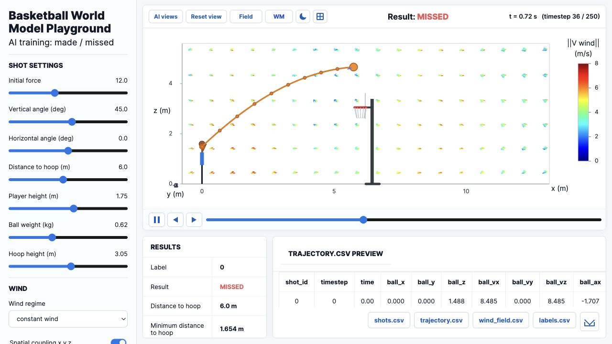

# Basketball World Model Playground

Interactive basketball shot simulator for exploring trajectory physics, synthetic datasets, and world-model predictions.

## Live Demo

[Open the Vercel deployment](https://basket-interface.vercel.app)



## What It Does

- Simulates basketball shots with force, angle, player height, ball mass, hoop height, and wind controls.
- Labels trajectories as made/missed for dataset generation.
- Includes local Python tooling for model training and inference.
- Keeps the public Vercel deployment static; the optional model server runs locally.

## Project Structure

```text
interface/              Browser UI and canvas simulation
dataset_generation/     Synthetic basketball trajectory tools
model/                  Feature contracts, world model scripts, training helpers
server/                 Local HTTP inference server
model/artifacts/        Local trained weights, ignored by Git
```

## Run The UI Locally

```bash
python3 -m http.server 8771
```

Then open:

```text
http://localhost:8771/interface/index.html
```

## Optional Python Setup

```bash
python3.11 -m venv .venv
.venv/bin/python -m pip install -r requirements.txt
```

Start the local prediction server:

```bash
./start_server.sh
```
